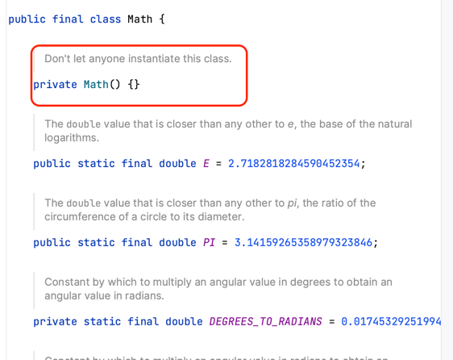

## 아이템 4
### 인스턴스화를 막으려거든 private 생성자를 사용하라

**static 메서드**와 **static 필드만을 담은 유틸리티 클래스**는 객체 지향과도 거리가 멀지만, 쓰임새가 있다.  
하지만, 해당 클래스를 abstract로 만들어도, 상속 받아서 인스턴스를 만들 수 있기 때문에 인스턴스를 만드는 걸 막을 순 없다.  

아무런 생성자를 만들지 않은 경우에도 컴파일러가 기본적으로 아무 인자가 없는 public 생성자를 만들어주기 때문에 그런 경우에도 인스턴스를 만들 수 있다.  

> **따라서 인스턴스화를 막기 위해선 명시적으로 private 생성자를 추가해야 한다.**  


#### ✔️ 유틸리티 클래스 예시

* `java.lang.Math` 예시



이와 같이 정적 멤버만 담은 유틸리티 클래스는 인스턴스로 만들어 쓰려고 설계한 게 아니다.  
but, 생성자를 명시하지 않으면 컴파일러가 자동으로 기본 생성자(매개변수 없는 public)를 만들어준다.  


#### ✔️ 인스턴스화 막기

* 추상 클래스로 만드는 것으로는 인스턴스화를 막을 수 없다.
  * 하위 클래스를 만들어 인스턴스화 하면 그만이다.
  * 추상 클래스를 본 사용자도 상속해서 쓰라는 뜻으로 오해할 수 있다.

> 💡 **private 생성자를 추가하면 클래스의 인스턴스화를 막을 수 있다.**

인스턴스를 만들 수 없는 유틸리티 클래스

```java
/**
 * 코드 4-1: 인스턴스를 만들 수 없는 유틸리티 클래스
 */
public class UtilityClass {

    /**
     * private 생성자
     *
     * - 클래스의 인스턴스화를 막을 수 있다 (기본 생성자가 만들어지는 것을 막는다.)
     * - 상속을 불가능하게 한다
     */
    private UtilityClass() {
        throw new AssertionError();
    }

}
```

* 명시적 생성자가 private
  * 클래스 바깥에서 접근할 수 없다.
  * Assertion Error를 던져 클래스 안에서 실수로라도 생성자를 호출하지 않도록 해준다.
  * **이 코드는 어떤 환경에서도 클래스가 인스턴스화되는 것을 막아준다.**
* **상속을 불가능하게 하는 효과가 있다.**
  * private으로 생성자를 선언했으니 하위 클래스가 상위 클래스의 생성자를 접근할 길이 막혀버린다.